# spring-boot-dumps

## Why we need Spring Framework?

### Servlet and Servlet containers
- Provides foundation for building web applications.
- Servlet is a Java class, which handles client request, process it and returns the response.
- Each Servlet handles get, post, put, delete kinda requests, and provides responses.
- Servlet Containers are the ones that manages the servlets.
- Web.xml this is where we write details of each mapping and servlets, provinding a type of filtering.
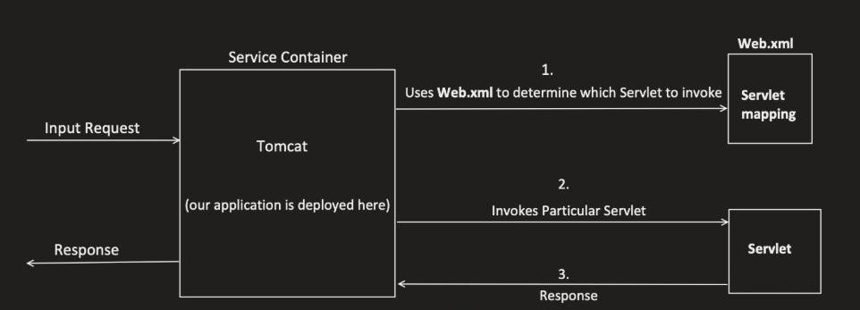


### Spring MVC and advantages over servlet
- Solves challenges which exists with servlets.

1. Removal of Web.xml 
- as it becomes too big to be handled when scaled.
- Spring introduces Annotations based configurations.

2. Inversion of Control
- provides more flexible way to manage Object dependencies and its lifecycle via Dependency Injection.

3. Easier Unit Testing  
- Earlier the object creation depends on servlet, mocking was difficult making UT hard.
- With DI it becomes very easy.

4. Easy to Manage RESTful APIs
- Spring MVC provides an organised approach to handle the requests and its easy to build RESTful APIs.

Refer to the flow below for spring
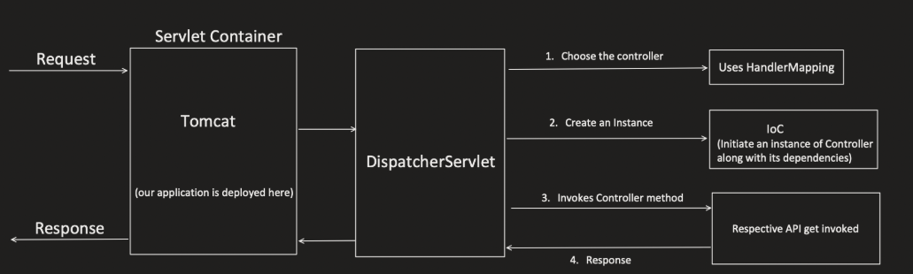

### Spring Boot and advantages over Spring MVC
Spring boot solves challenges which exists in Spring MVC. It provides a quick way to create a production ready application based on spring framework.

1. Dependency Management: No need for adding different dependencies seperately and their compatible versions.
2. Auto Configuration: No need for seperately configuring "DispatcherServlet", "AppConfig","EnableWebMvc","ComponentScan".Spring boot adds them internally.
3. Embedded Server: In Spring boot, Servlet container is already embedded, we dont need to deploy the WAR files. Just run the application.

## Setup Spring Boot Application
- Go to start.spring.io
- JAR - Java Archive - for Java standalone application, currently used in microservice world
- WAR - Web Archieve - when we need HTML, CSS, JS and other files
- Add Spring web as dependency and we can add other dependency later.
- Click on Generate and import the folder in any IDE like VSCode or IntelliJ

## Layered Architecture
Most companies prefer this kinda architecture for their applications
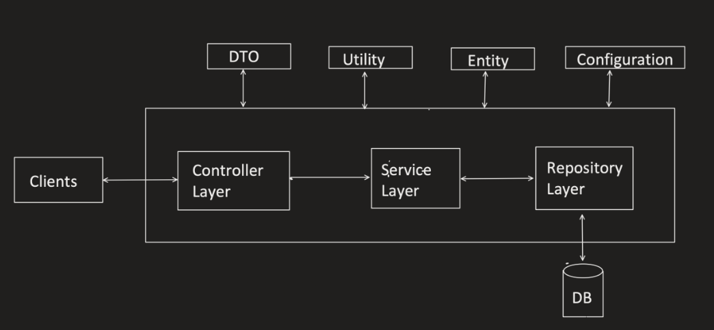

Controller Layer: handles all the controllers. Classes which host endpoints. having @Controller  / @RestController
Service Layer: handles bussiness logic.
Repository Layer: handles interactions with the db

DTO: Data Transfer Objects -  to transfer data amoung layers.
Utility: represents common methods or helper methods.
Entity: @Entity aka POJOs provides direct representation of the tables in the db. helps in data insertion/extraction.
Configuration: for handling configurations. present in application.configuration files. Differs based on ENVs.


## Maven
- Its a project management tool.Helps with
    - Build generation
    - Dependency resolution
    - Documentation etc
- Maven uses POM(Project Object Model) to achieve this.
- When maven command is executed, it looks for "pom.xml" in the current directory and gets needed configurations.
- In Maven we generally need to tell What to do and it knows how to do.
- Before maven, Ant was popular but there we need to tell it what to do adn how to do.
- refer to this for more details: https://notebook.zohopublic.in/public/notes/bietv1d00e57bcbca4be89f155f6039985778
### Project Structure for maven
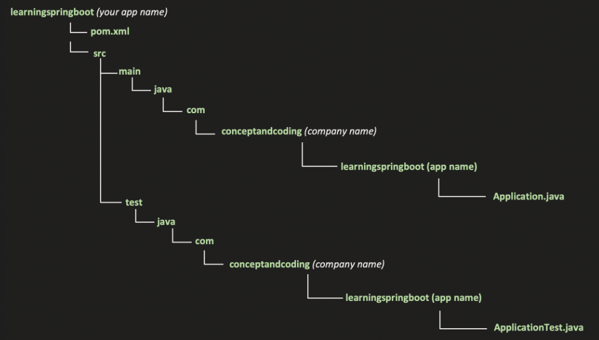


### POM file structure
```xml
<?xml version="1.0" encoding="UTF-8"?>

<!-- Specifies the XML Schema, and makes sure out pom file adheres to it. -->
<project xmlns="http://maven.apache.org/POM/4.0.0" xmlns:xsi="http://www.w3.org/2001/XMLSchema-instance"
	xsi:schemaLocation="http://maven.apache.org/POM/4.0.0 https://maven.apache.org/xsd/maven-4.0.0.xsd">
	<modelVersion>4.0.0</modelVersion>
	
    
    <!-- Used to Defile the parent project -->
    <!-- Each pom has one parent pom bydefault. -->
    <!-- Superpom is at the top of hierarchy. Used if this parent field is not specified. -->
    <parent>
		<groupId>org.springframework.boot</groupId>
		<artifactId>spring-boot-starter-parent</artifactId>
		<version>3.4.1</version>
		<relativePath/> <!-- lookup parent from repository -->
	</parent>


    <!-- Uniquely identifies the project -->
	<groupId>com.example</groupId>
	<artifactId>spring-boot-dumps</artifactId>
	<version>0.0.1-SNAPSHOT</version>
	<name>Spring boot Dump Project</name>
	<description>Project for Spring Boot</description>
	

    <!-- Define key value pair for configurations. And later can be references anywhere -->
	<properties>
		<java.version>17</java.version>
	</properties>

    <!-- This is where maven looks for dependencies and download the artifacts(jars). -->
    <!-- bydefault present in superpom.  -->
    <repositories>
		<repository>
			<id>central</id>
			<url>https://repo1.maven.org/maven2/</url>
		</repository>
	</repositories>


	<dependencies>
		<dependency>
			<groupId>org.springframework.boot</groupId>
			<artifactId>spring-boot-starter-web</artifactId>
		</dependency>

		<dependency>
			<groupId>org.springframework.boot</groupId>
			<artifactId>spring-boot-starter-test</artifactId>
			<scope>test</scope>
		</dependency>
	</dependencies>

    <!-- defines the maven lifecycle,  -->
	<build>
		<plugins>
			<plugin>
				<groupId>org.springframework.boot</groupId>
				<artifactId>spring-boot-maven-plugin</artifactId>
			</plugin>
		</plugins>
	</build>

</project>

```


### Maven Build Lifecycle
- Maven lifecycle is divided into 7 phases and each phase has multiple goals(tasks).
- If you run any phase/goal, all the phases/goals prior to that phase/goal executes first.

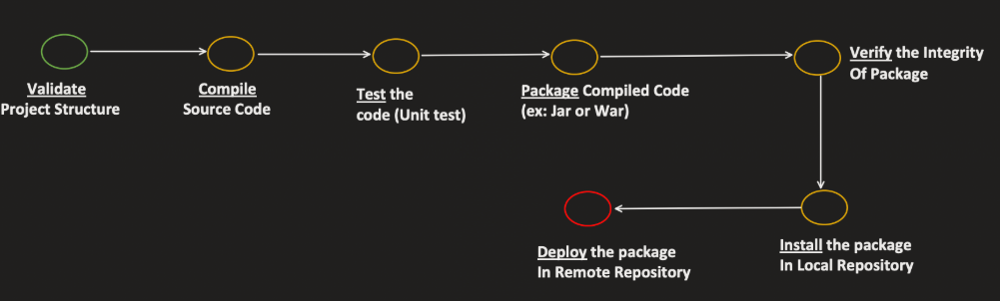

1. validate: validates the code before compiling. Maven does't restrict anything here but we can add goals. Like validating code style, formatting etc.
2. compile: converts the java code to bytecode. .class files. Puts the bytecode into target/classes.
3. test: runs the test cases of the project in src/test
4. package: package compiled code into JAR(.jar) or WAR(.war).
5. verify: check the integrity of the package. Maven does't restrict anything here but we can add goals. like PMD source code analyzer.
6. install: Installs the .jar package into local repository. typically located in (~/.m2/repository). We can change the path in /.m2/settings.xml file.
7. deploy: Installs the .jar package into remote repository. We can provide the repo url in the pom file and private repo we can put username & password in settings.xml. If we try to run deploy without providing the url we will see the error.

Note: If we want to deploy the manifest to maven central repository we can use: https://repo.maven.apache.org/maven2/. Since its public we dont need username and password.

Note: To configure remote repo:
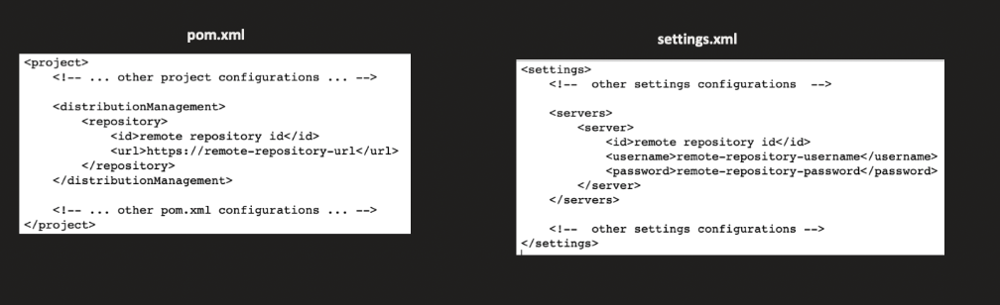

## Spring Boot Annotations

- @SpringBootApplication
- @Controller - indicates that this class is responsible for handling incoming HTTP requests.
- @RestController - @Controller + @ResponseBody (no need to use the @ResponseBody annotation explicitly)
- @ResponseBody - tells the controller to consider the return type should be considered as HTTP response. Creates ResponseEntity internally for response.
- @RequestMapping - to map the request like path, method etc. We can also write this at the class level for common paths.
	- @GetMapping - Request mathod is already defined in this
	- @PostMapping - Request mathod is already defined in this

- @RequestParam - Used to bind, request parameter to controller method parameter. Framework automatically performs type conversion from the request parameter's string representation to the specified type. We can also use Custom object type to do some custom type casting using @InitBinder
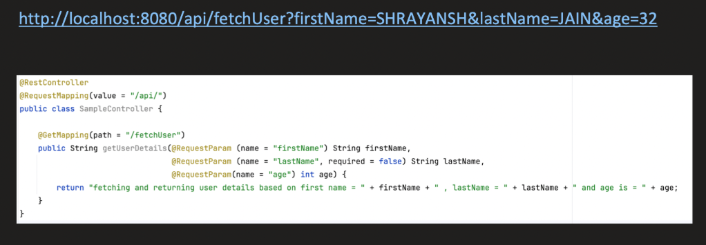

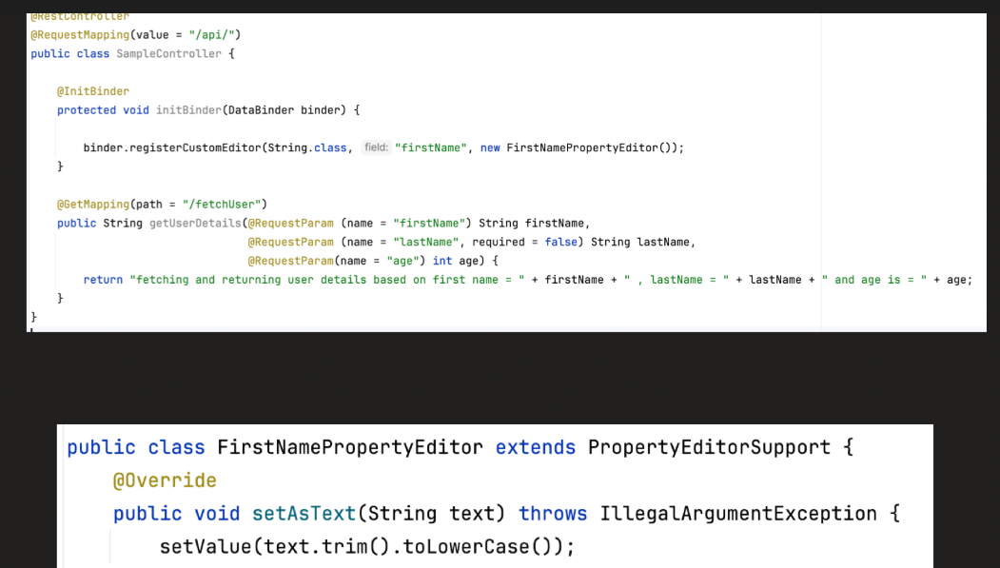

- @PathVariable - for extracting path variables
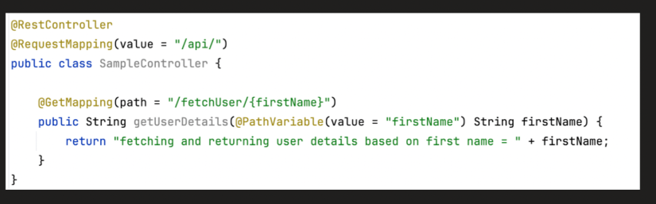

- @RequestBody - bind the body of the HTTP request(typically JSON) to controller method parameter(Java object). Use same name in class variable as there is in JSON. if not we can bind them by using @JsonPoperty("").
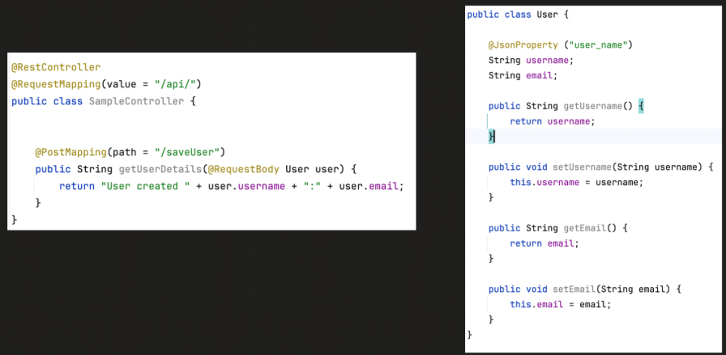

- @ResponseEntity - it represents the entire HTTP response. Contains body, http codes, headers etc.
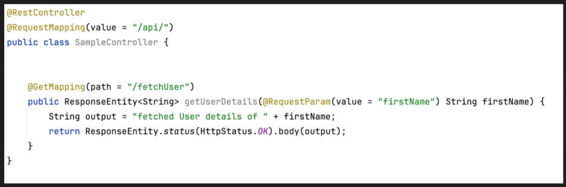

- refer to this for more details - https://notebook.zohopublic.in/public/notes/bietv0de3bac30fbd41e7b1346bf9243ad3b2

## Bean and its lifecycle
- Bean is a Java object which is managed by spring containers aka IOC containers.
- IOC containers - contains all the beans which get created and manage them.
- How to create a bean - @Component or @Bean

### @Component
- follows convention over configuration approach.
- Spring boot will try to autoconfigure reducing the need for explicit configuration.
- @Controller, @Service etc all internally tells spring to create the bean and manage it.
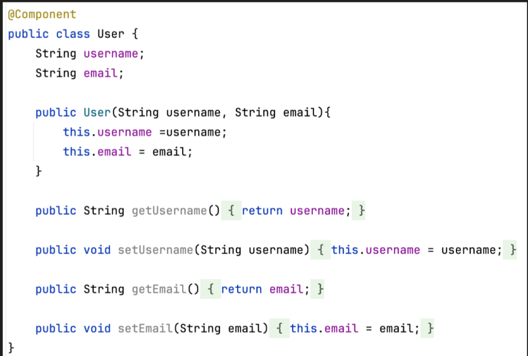

### @Bean
- used when we need to specify configuration details and tell spring to use it when creating bean. In the case below we are using a parameterised contructor instead of a default one. So we need to provide extra configs.
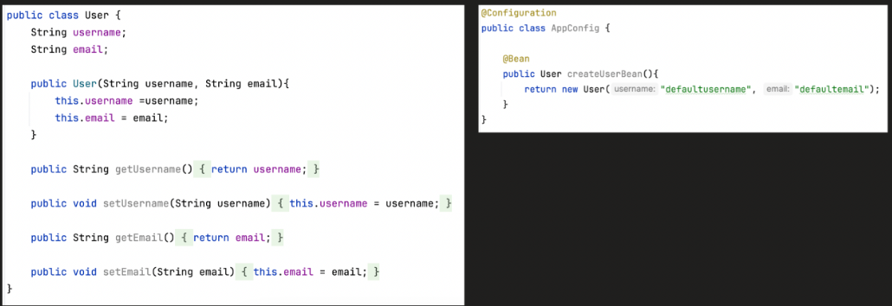


#### How spring boot find these beans?
1. Using @ComponentScan annotations, it will scan the specified packages and sub-packages for classes annotated with @Component, @Service etc. Bydefault @SpringBootApplication also has ComponentScan in it.

2. Through explicitly defining bean via @Bean in @Configuration class.

#### At what time, does the beans get created?
1. Eager initialization - as soon as we startup the application. Example - beans with singleton scope.
2. Lazy initialization - when they are actually needed. Example - beans with prototype scope. or with @Lazy annotation


### Lifecycle of a Bean

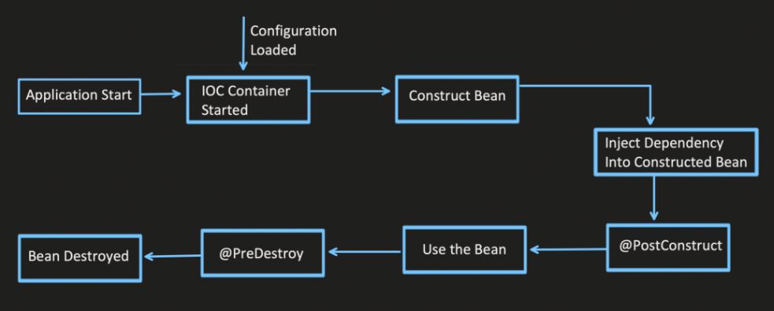
 
refer to the link for more details: https://notebook.zohopublic.in/public/notes/bietv2018487e1de84b009904a4dfeda24def

## Dependency Injection
- It helps to remove the dependency on concrete implementation and inject the dependencies from external sources.
- it is a programming technique that allows objects to receive the objects or functions they need from an outside source, instead of creating them internally. This technique is used to reduce hardcoded dependencies between objects and can lead to cleaner, more flexible code. 
- refer to the link for more details: https://notebook.zohopublic.in/public/notes/bietv964a637b52be4a1bbfde8d0309040a79
## Bean Scope:
- Singleton
	- Default scope
	- only 1 instance created per IOC.
	- Eagerly initialized by IOC (means at the time of startup application gets created).
	- @Scope("singleton") and @Scope(value = ConfigurableBeanFactory.SCOPE_SINGLETON)
- Prototype
	- Each time a new object is created
	- Its lazy initialised, object is created only when it is required.
- Request
	- New Object is created for each HTTP request, unlike Prototype it wont be created everytime it is injected.
	- Lazy initialization
- Session
	- New Object is created for each HTTP session.
	- Lazy initialized
	- When user accesses any endpoint session is created
	- remains active till it does not get expired.
- Application
	- When we need to share the single object between multiple IOC containers unlike singleton in one one IOC container.

Note: What happens when we inject a depenency with Request scope into a class with singleton scope. Since there is no HTTP request at the time of startup it will run into an error.
- Solution To resolve this we will need to use proxyMode which helps in providing a proxy object during startup. It wont be initialised like its contructor and postConstruct wont be called but somehow a dummy object will be injected.
- @Scope(value = "request", proxyMode = ScopedProxyMode.TARGET_CLASS)

refer to the link for more details: https://notebook.zohopublic.in/public/notes/bietv379bff087eca47eaa84a3024d7e14b46


## Unsatisfied Dependency Problem
- Problem statement: single interface having multiple implementation each serving as a bean, when injecting the dependency of that bean, now spring is confused which one to call. Application will fail to start.
-  1st Solution: Using @Qualifier("alias") on both the implementation by providing an alias name, and add this same @Qualifier with Autowired, making it a hard wired/ tight coupling.
- Standard Dynamic Solution 1: inject both the implementation with the alias and in the logic choose which one you want. 
- Dynamic Solution 2: Take the input from the configuration file using @Value annotation which gets the values from application.properties/configs.

refer to the link for more details: https://notebook.zohopublic.in/public/notes/bietv13e5f5aeff684305a86e2d251aa4deed

## @ConditionalOnProperty Annotation
- Bean is created conditionally (bean might or might not be created).
- refer to the link for more details: https://notebook.zohopublic.in/public/notes/dcr5z97c7e76aa1454ea6a57e1a2dde4f8785


## Spring boot Profiles
- Spring Profiles provide a way to segregate parts of your application configuration and make them available only in certain environments. This allows you to have different configurations for different environments, such as development, testing, and production.
- application-dev.properties like this way we can provide configs for each environment. 
- spring.profile.active=dev/qa/prod/..  via this way we can tell spring which config to use during startup. We need to put this in default config file.
- dynamically mvn spring-boot:run -Dspring-boot.run.profiles=prod
- or we can add in pom.xml using profiles and use the below command 
- mvn spring-boot:run -Pproduction
- We can use @Profile("prod") to any bean and will be initialised only if that profile is set.
- We can also set multiple profiles at a time in default properties file.
- refer to the link for more details: https://notebook.zohopublic.in/public/notes/dcr5ze84495de6ad14cadbf5fe38b99b18b9d


## AOP (Aspect oriented Programming)
- Spring AOP module has some useful features like it provides interceptors to intercept an application. For example, when a method is executed in a system, then you can also add extra features and functionality before or after the method has been executed.
- For this aspect we need to provide the below items
	- Pointcut - Tells the spring where to look
	- Advice - Tells the spring what to do and when. @Before, @After or @Around
- refer to the link for more details: https://notebook.zohopublic.in/public/notes/dcr5z12bd30d9fbc2454e9881904115682227

## TRANSACTIONS
- In spring boot we can achieve the TRANSACTION property via @Transactional annotation
- Before starting go through the below Pre-study to gain more insights.
### Pre-study - Consurrency control in distributed systems
- one way is to use SYNCHRONIZED for critical resources when there is a single process with multiple threads but what in case of districuted systems.
- For Distributed systems
	1. Optimistic Concurrency Control- 
		- Uses REPEATABLE READ Isolation levels. having higher concurrency.
		- No deadlocks as this maintains version.
		- We can also rollback and retry in case of conflict
	2. Pessimistic Concurrency Control
		- Isolation level REPEATABLE READ and SERIALIZABLE. Less concurrency compared to optimistic
		- Deadlock possible, will need to rollback if it happens
		- Timeout issues possible in case of long running lock in a single transaction.
- Transaction helps us to achieve Integrity. and helps us to avoid inconsistency in our DB. If all success we COMMIT or else we ROLLBACK.
- DB Locking helps use to make sure no other transaction update the locked row which is being used in some other transaction.
	- Shared lock - read lock
	- Exclusive lock - write lock
- Isolation levels - find below. As we go down the concurrency level decreases
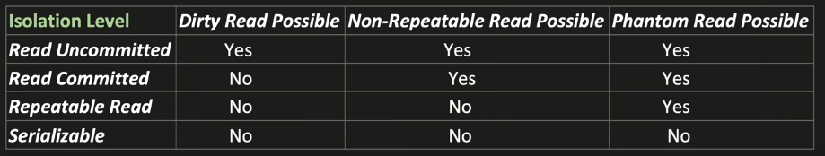
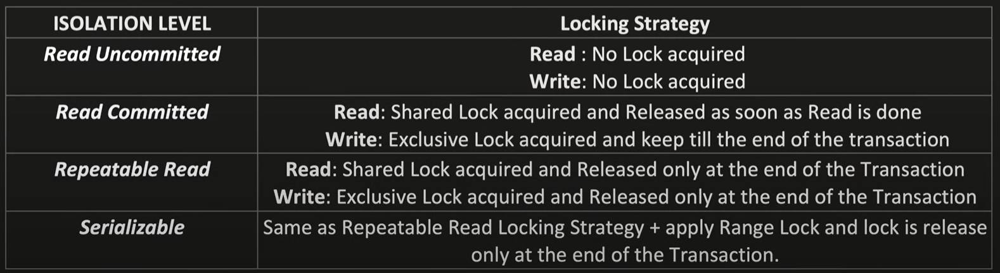
	
	- Dirty Read - If transaction A reads the data which is being written by Transaction B but not yet committed and somehow B has to rollback. then whatever the data A has will be called dirty read.
	- Non-Repeatable read- If A reads the same row several time and there is a chance that it reads a different value. might have been changes by some other transaction before A completed.
	- Phantom read - if A executes same query several time and there is a change that rows returned are different.

### @Transactional
- helps in achieving Transaction Management.
- We will need to add dependency in the pom file and configuration file.
- We can activate Transaction Management by using @EnableTransactionManagement in the main class(spring boot generally auto configures it)
- Ways to use @Transactional
	1. At class level: Transaction applied to all the public methods only.
	2. At Method level: Transaction applied to particular method only.
- internally @Transactional uses AOP. It handles all the duplicate code. which is maintaining Transaction levels.
	- Uses point cut to find the methods and classes with @Transactional annotations
	- Runs Around type Advice